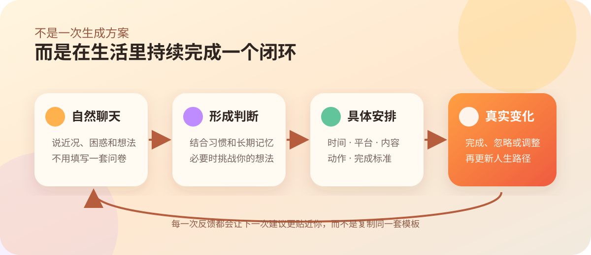
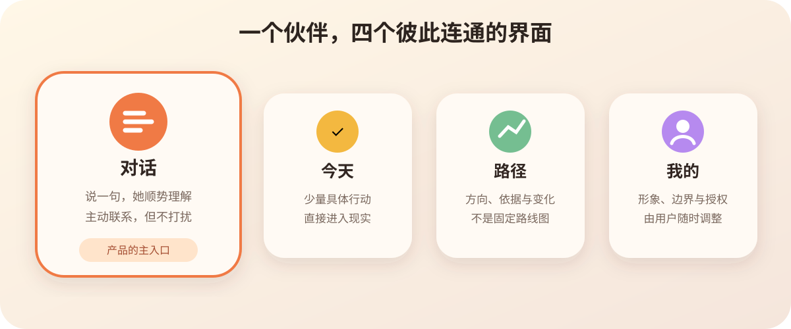

# 学程 Xuecheng

> 一个会在日常对话中逐渐了解你，把人生建议变成今天具体行动的私人伙伴。

<p align="center">
  <a href="https://hamlitonalex.github.io/edith/"><strong>Web 在线体验</strong></a>
  · <a href="https://appetize.io/app/ios/com.xuecheng.companion?device=iphone14pro&osVersion=16.2&toolbar=true"><strong>可操作的 iPhone 演示</strong></a>
  · <a href="PRODUCT.md"><strong>产品定义</strong></a>
  · <a href="docs/github-showcase.md"><strong>首发说明</strong></a>
</p>

<p align="center">
  
</p>

学程不是让你再维护一套复杂系统，也不是一次生成一份宏大的人生方案。你只需要像与一位长期了解你的朋友聊天；她会从对话、日程和你授权的信息中逐渐理解处境，指出可能忽略的问题，并把建议落实到现实世界里。

## 它解决什么

很多人的成长处于“野蛮生长”状态：知道自己应该学习、规划和改变，却缺少一个持续了解自己、敢于提出不同意见、又能把建议落到每天时间表里的人。

学程希望补上这个位置：**伙伴、家人、朋友或引路人**。她不替你决定人生，但会和你一起形成判断，并持续追踪判断有没有带来真实变化。

<p align="center">
  
</p>

## 一次真实交互是什么样的

| 不是这样 | 而是这样 |
| --- | --- |
| “今晚学习通识知识” | “18:00–18:30，打开 B 站观看《农业革命》第 1 集前 20 分钟；结束后用一句话告诉我最意外的观点。” |
| “提升表达能力” | “午休后打开微信文件传输助手里的演讲稿，录一遍 90 秒开场；我会帮你找出一个最影响理解的问题。” |
| “制定长期规划” | 在平常聊天中逐渐形成可修改的路径地图，并记录每次调整的依据。 |

任务必须包含：**时间、平台、具体内容、动作、完成标准，以及“为什么是你、为什么是现在”**。缺少其中任何一项，就还只是屏幕里的建议。

## 现在能做什么

| 能力 | 当前状态 | 你能看到的结果 |
| --- | --- | --- |
| 自然对话与按住说话入口 | 可演示 | 不需要先填写问卷 |
| 具体到平台和内容的今日安排 | 可演示 | 每项任务可直接进入现实动作 |
| 路径地图与调整理由 | 可演示 | 看见短期安排如何连接长期方向 |
| AI 引路人 Agent Loop | 已接入对话页 | 判断单一下一步、解释原因、协商、教学、验收并更新能力证据 |
| 独立判断与用户最终决定权 | 已实现，可测试 | 会提出异议、说明把握与改判条件，也会服从用户明确的最终决定 |
| Obsidian 检索与模型网关 | 核心接口已实现 | 知识库与 Agent Memory 分离；模型不能直接篡改能力状态 |
| 通识资源候选层 | 已收录用户提供的 42 个候选来源 | 按年龄、主题、表达风格与平台筛选；具体内容核验后才可推荐 |
| 伙伴形象、关系、主动程度和主题 | 可演示，本地保存 | 助手更像属于你的一个人 |
| Web 与 iPhone 模拟器 | 可体验 | 不安装即可理解完整交互 |
| 未签名 IPA 自动构建 | 已完成 | 可下载后使用自己的工具签名安装 |
| 日历、文件、微信、抖音数据接入 | 规划中 | 尚未伪装为已连接 |
| 云端模型、主动通知、跨端同步 | 规划中 | 进入下一阶段 |

## 产品界面

<p align="center">
  
</p>

- **对话是主界面**：所有理解从自然交流开始，方案在聊天中逐渐长出来。
- **今天负责落地**：只呈现少量、具体、可执行的安排。
- **路径负责方向**：展示长期方向、当前判断、证据和最近变化。
- **我们负责关系**：伙伴形象、关系、主动程度与界面氛围。
- **设置负责边界**：使用方案、模型厂商、同步、安静时段和数据授权由用户控制。

## 立即体验

最快的方式是打开 [Web 在线体验](https://hamlitonalex.github.io/edith/)；如果想看到接近真实 iPhone 的尺寸与交互，请使用 [iPhone 模拟器](https://appetize.io/app/ios/com.xuecheng.companion?device=iphone14pro&osVersion=16.2&toolbar=true)。

本地运行需要 Node.js 22 或更新版本：

```bash
npm ci
npm test
npm run dev
```

打开 `http://localhost:4173`。构建可部署的静态站点：

```bash
npm run build:web
```

## 构建 iPhone 应用

项目使用 Capacitor 共享 Web 界面，并保留原生 iOS 容器：

```bash
npm run mobile:sync
```

Windows 可以完成网页构建与同步，但 iPhone 二进制仍需要 macOS/Xcode。`codemagic.yaml` 提供两个流程：

- `ios-simulator-preview`：生成可上传 Appetize 的 `.app` 模拟器包；
- `ios-unsigned`：生成 `Xuecheng-unsigned.ipa`，供用户使用自己的签名工具签名后安装。

未签名 IPA 不能直接安装，也不等同于 TestFlight 或 App Store 正式发行包。

## 系统如何工作

```text
Observe → Diagnose → Decide → Propose → Negotiate
   ↑                                      ↓
 Learn ← Verify ← Tutor / Execute ← 用户最终决定
```

Agent 每轮读取长期目标、能力证据、最近学习、现实限制和今天的状态。它一次只选择一个下一行动，保留判断依据、反方理由、置信度和改判条件。“点了完成”不会自动成为掌握证据；用户需要用自己的话解释，系统才会更新能力模型。完整边界见 [Agent Loop v1 架构决策](docs/architecture/agent-loop-v1.md)。

## 项目结构

```text
apps/web/iphone.*           iPhone-first 产品界面
apps/web/agent/             主 Agent 与观察、规划、教学、验收、记忆、候选资源模块
apps/web/assets/            产品图标与可替换伙伴形象
packages/event-schema/      统一事件协议
ios/                        Capacitor 原生 iOS 容器
docs/                       产品、集成与研究文档
codemagic.yaml              iOS 模拟器与 IPA 构建
.github/workflows/pages.yml Web 演示自动部署
```

## 诚实边界

- 演示对话和安排用于验证产品结构，不代表系统已经掌握用户生活。
- 连接器只有真实可用后才会出现连接操作。
- 自动测试验证软件行为，不证明教育效果。
- 伙伴可以提出挑战和新方向，但高风险执行必须由用户确认。
- 默认本地保存个人数据；云同步、模型厂商和外部数据源由用户选择。

## 接下来

1. 稳定 iPhone 对话、输入、语音和今日安排闭环；
2. 接入模型供应商与可审计的长期记忆；
3. 从日历和文件开始实现授权数据接入；
4. 增加主动通知、安静时段和执行确认；
5. 在个人系统稳定后扩展家庭模式与 Windows 端。

如果你也认为 AI 不该只活在聊天框里，欢迎 Star、提出 Issue，或参与移动端体验、隐私架构和数据连接器的实现。
